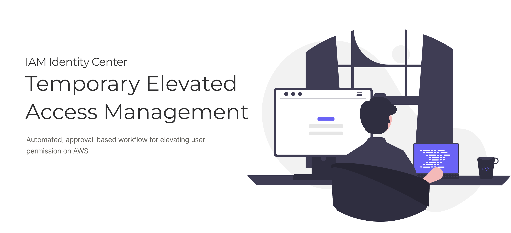

# Elevator — Temporary Elevated Access Management for AWS IAM Identity Center

Elevator is an open-source, self-hosted application for managing and auditing
**time-bound, just-in-time elevated access** to your multi-account AWS
environment at scale. It integrates with AWS IAM Identity Center so users can
**request access to an AWS account only when they need it, and only for a
defined period of time**. When the window elapses, the elevated access is
revoked automatically.



## Features

- **Just-in-time access requests** — users request access to a specific account
  and permission set for a bounded duration.
- **Approval workflows** — configurable approvers per account/OU, with optional
  auto-approval and multi-step review.
- **Automatic revocation** — access is removed automatically when the session
  expires; no manual clean-up.
- **Eligibility policies** — define who is eligible to request what, by user,
  group, account, or OU.
- **Full audit trail** — every request, approval, and session is recorded and
  queryable, backed by a CloudTrail Lake event data store.
- **Notifications & on-call routing** — email/SNS notifications plus optional
  on-call integrations (e.g. BetterStack) to route approvals to whoever is on
  duty.
- **SSO login** — sign in through IAM Identity Center via SAML federation.

## Architecture

Elevator deploys as a single AWS CDK stack and a static frontend:

- **Frontend** — React + Vite, using the [Cloudscape](https://cloudscape.design/)
  design system, served from S3 behind CloudFront.
- **API** — Amazon API Gateway (HTTP API) fronting a Python AWS Lambda backend.
  The backend uses typed (Pydantic) request/response models; the OpenAPI spec
  and the frontend's TypeScript client types are generated from those models.
- **Auth** — Amazon Cognito user pool with SAML federation to IAM Identity
  Center. The IAM Identity Center SAML application is created automatically
  during deployment.
- **Data** — Amazon DynamoDB tables for requests, sessions, approvers,
  eligibility, and settings.
- **Access provisioning** — IAM Identity Center account assignments are created
  and removed to grant and revoke access.
- **Audit** — AWS CloudTrail Lake event data store for durable, queryable audit
  logs.

## Getting Started

Elevator can be deployed with **either** infrastructure-as-code tool — pick one per
environment:

| Tool | Deploy the app | CI/CD pipeline |
|------|----------------|----------------|
| **AWS CDK** | [`deployment2/`](deployment2/README.md) | [`deployment2/bootstrap.sh`](deployment2/README.md#deployments-with-codepipeline-optional) |
| **Terraform** (S3 state) | [`terraform/`](terraform/README.md) | [`terraform/pipeline/`](terraform/pipeline/README.md) |

The CDK quick start is below; for Terraform see [`terraform/README.md`](terraform/README.md).

The full CDK deployment guide lives in **[`deployment2/README.md`](deployment2/README.md)**.
In short:

```bash
# 1. Configure your environment
cd deployment2
cp 00-params-template.sh 00-params.sh
# edit 00-params.sh with your account, region, and IAM Identity Center groups

# 2. (Optional) set up a custom domain and certificate
./02-create-domain-and-cert.sh

# 3. Deploy Elevator (backend + frontend, including the IdC SAML app)
./03-deploy.sh
```

**Prerequisites:** AWS CLI configured with appropriate credentials, Node.js +
npm, Python 3.12+, the AWS CDK CLI (`npm install -g aws-cdk`), and IAM Identity
Center enabled in your organization. See
[`deployment2/README.md`](deployment2/README.md) for delegated-administrator
setup and custom-domain options.

## Development

```bash
# Install frontend dependencies
npm install

# Type-check and build the frontend
npm run typecheck
npm run build

# Run against a deployed backend locally
#   generate src/config.json from your deployed stack, then:
npm run dev
```

`src/config.json` is generated from your deployed stack outputs (see
`deployment2/generate-config.py`) and is intentionally not committed. Use
[`src/config.example.json`](src/config.example.json) as a reference for the
expected shape.

### Regenerating the API types

When you change the backend API models (`lambda/backend/models/api_models.py`)
or endpoints (`lambda/backend/index.py`), regenerate the OpenAPI spec and the
frontend TypeScript types:

```bash
cd lambda/backend && uv run python generate_openapi.py > ../../openapi.json
cd ../.. && npm run generate:api
```

## Contributing

Contributions are welcome! Please read [CONTRIBUTING.md](CONTRIBUTING.md) and our
[Code of Conduct](CODE_OF_CONDUCT.md) before opening an issue or pull request.

## Security

If you discover a potential security vulnerability, please **do not** open a
public GitHub issue. Report it privately as described in
[CONTRIBUTING.md](CONTRIBUTING.md#security-issues).

## Acknowledgments

Elevator began as a fork of the
**[Temporary Elevated Access Management (TEAM)](https://github.com/aws-samples/iam-identity-center-team)**
sample published by Amazon Web Services under the MIT No Attribution (MIT-0)
license, and described on the
[AWS Security Blog](https://aws.amazon.com/blogs/security/temporary-elevated-access-management-with-iam-identity-center/).
We're grateful to the original authors for the design and the foundation it
provided.

Elevator has since been substantially rewritten — including a new REST/OpenAPI
backend, a single-stack CDK deployment, SAML federation, and a rebuilt
frontend — and is maintained as an independent project. Elevator is **not
affiliated with, endorsed by, or sponsored by Amazon Web Services**. See the
[LICENSE](LICENSE) for the original notice.

## License

Elevator is licensed under the [MIT License](LICENSE).
