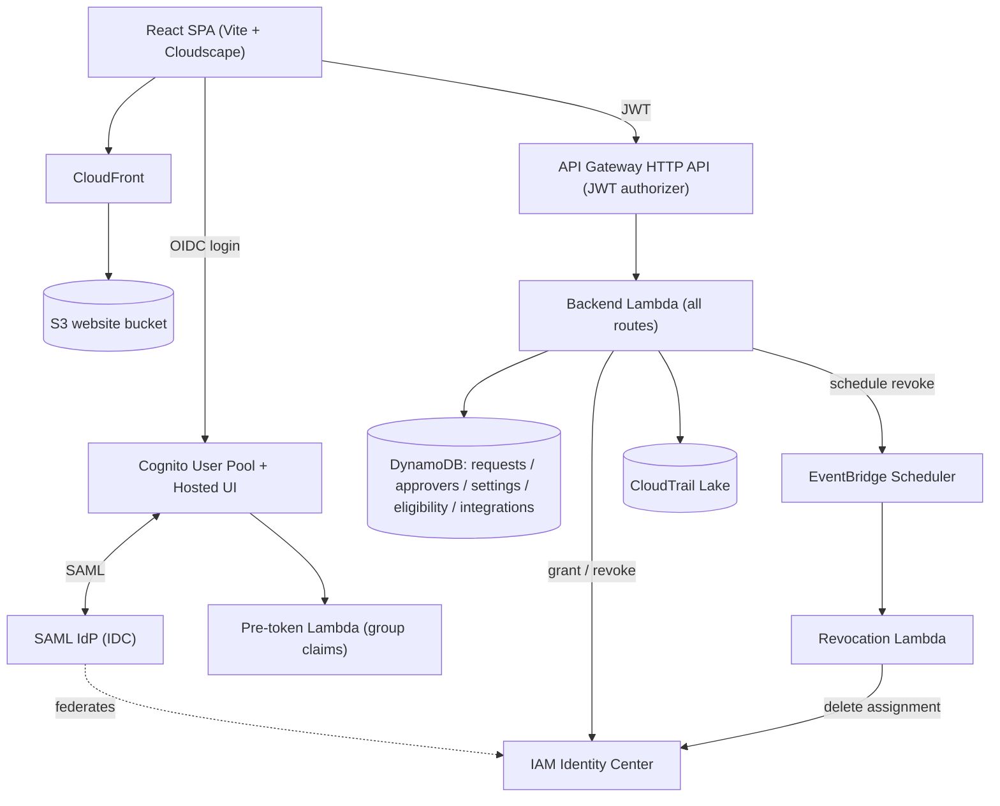

# Elevator — Architecture

Elevator is a self-hosted, just-in-time access manager for AWS. Users request
**time-bound** elevated access to an AWS account + permission set; once approved, the
grant is created in IAM Identity Center and **automatically revoked** when it expires.

This document explains the moving parts, how a request flows through them, and where
state lives.

## Components at a glance

### Frontend
- **React + Vite + [Cloudscape](https://cloudscape.design/)** single-page app in `src/`.
- Served as static files from a private **S3 bucket** behind **CloudFront** (SPA
  routing: 403/404 → `index.html`).
- Reads runtime settings from **`src/config.json`** (Cognito IDs, API endpoint,
  domain). This file is generated from stack outputs at deploy time
  (`deployment/generate-config.py`) and is not committed.
- API calls use `openapi-react-query` with types generated from the backend's OpenAPI
  spec (`src/api/`).

### Authentication
- **Amazon Cognito user pool** with a **SAML identity provider ("IDC")** federated to
  **IAM Identity Center**. Users sign in through IdC; Cognito issues the tokens.
- The IdC **SAML application** is created automatically at deploy time by a custom
  resource (`lambda/idc-app/`) — there is no public API for this, so it drives the
  same console APIs the AWS UI uses.
- A **pre-token generation Lambda** (`lambda/pretoken/`) enriches the ID token with
  the user's group claims (IdC group memberships + the configured admin/auditor
  groups), which the frontend and backend use for authorization.

### API
- **API Gateway HTTP API** with a **Cognito JWT authorizer**. A single proxy route
  (`ANY /{proxy+}`) forwards every request to the backend Lambda.
- **Backend Lambda** (`lambda/backend/`, Python, AWS Lambda Powertools) does all
  routing and business logic — requests, approvals, sessions, eligibility, settings,
  integrations, on-call, and audit queries.

### Access lifecycle (grant / revoke)
1. A user submits a **request**: account, permission set, duration, justification.
2. The backend checks **eligibility** (the `eligibility` table): which accounts +
   permission sets the user (or their IdC groups) may request, max duration, whether
   approval is required, self-approval, and auto-approval-when-on-call.
3. Approval:
   - If the policy allows **auto-approval on-call** and the requester is currently
     on-call (via the configured on-call **integration**), it's approved automatically.
   - Otherwise it's routed to the configured **approvers**.
4. On approval, the backend creates an **IAM Identity Center account assignment**
   (`sso:CreateAccountAssignment`) — the actual grant.
5. The backend registers an **EventBridge Scheduler** schedule to invoke the
   **revocation Lambda** at the session's expiry.
6. At expiry (or on manual revoke/cancel), the **revocation Lambda** deletes the
   account assignment (`sso:DeleteAccountAssignment`).

### Audit
- A **CloudTrail Lake event data store** captures write (non-read-only) management
  events across the org. The backend can query it for session activity.
- Every request/approval/session is also recorded in DynamoDB.

### Notifications
- Configurable per-deployment (in the `settings` table): **SNS**, **SES** email, and
  **Slack**. See [customization](customization.md).

## Data model (DynamoDB)

All tables are on-demand (`PAY_PER_REQUEST`), point-in-time-recovery enabled, and
retained on stack deletion.

| Table | Key | Purpose |
|-------|-----|---------|
| `elevator-requests-<env>` | `id` (+ GSIs `byEmailAndStatus`, `byApproverAndStatus`) | Access requests & their status/lifecycle |
| `elevator-approvers-<env>` | `id` | Approver assignments (who approves what) |
| `elevator-eligibility-<env>` | `id` | Entitlement policies (who may request what, duration, approval rules) — also used as the policy table |
| `elevator-settings-<env>` | `id` | Application settings (notifications, admin/auditor groups, etc.) |
| `elevator-integrations-<env>` | `name` | Third-party integration config: `{ name, params }` (e.g. on-call provider) |

## Infrastructure & IaC

Elevator ships **two interchangeable IaC implementations** (pick one per environment):

- **AWS CDK** — `cdk/lib/elevator-stack.ts` (the app) and `cdk/lib/pipeline-stack.ts`
  (the CI/CD pipeline). Deploy scripts in `deployment/`.
- **Terraform** — `terraform/` (the app, S3 state backend) and `terraform/pipeline/`
  (the pipeline). See `terraform/README.md`.

Both create the same resources with the same names. The **backend and pretoken
Lambdas** are Python; CDK bundles them with `PythonFunction`, Terraform with
`terraform/scripts/build-lambdas.sh` (uv).

### CI/CD
A CodePipeline (`elevator-<env>`) deploys the app from GitHub:
`Source → UpdatePipeline (self-mutate) → [Deploy-NonProd?] → Approve-Prod → Deploy-Prod`.
App config is stored in **SSM Parameter Store** (`/elevator/<env>/config/*`) and read
at deploy time. See [`deployment/README.md`](../deployment/README.md) and
[`deployment/CICD_PROPOSAL.md`](../deployment/CICD_PROPOSAL.md).

## Repository layout

| Path | What |
|------|------|
| `src/` | React frontend |
| `lambda/backend/` | Backend Lambda (Python) — API routing + business logic |
| `lambda/pretoken/` | Pre-token generation Lambda (group claims) |
| `lambda/idc-app/` | IdC SAML application custom resource |
| `cdk/` | CDK app (`elevator-stack.ts`, `pipeline-stack.ts`, `domain-stack.ts`) |
| `terraform/` | Terraform app + `terraform/pipeline/` |
| `deployment/` | Deploy scripts, pipeline bootstrap, config generation |
| `openapi.json`, `src/api/schema.d.ts` | Generated API spec + TS types |
